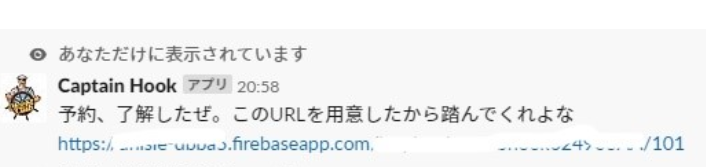
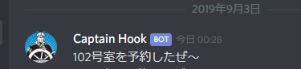

## Captain_Hook
SlackからDiscordへメッセージを送るBotです。

Slackでの様子

Discordでの様子

サークルのSLACKでグループ通話などしたいときに無料会員ではできないのでDiscordの会議室サーバーでグループ通話をするのが恒例になっています。

Discordの会議室の取り合いを避けるためによく会議が提案されるSlackから予約をとれるようにしました。

- Slack上で`/book101`と打ち込むと会議室101号室を予約したぜと言う意のメッセージがDiscord会議室サーバーに送られます。
- 同じく`/book102`で会議室102号室を予約したぜと言う意のメッセージがDiscord会議室サーバーに送られます。

＊DiscordWebHookURLは適当なものにすり替えています。

＊実際はfirebase cloud functions でルーティングしています。

